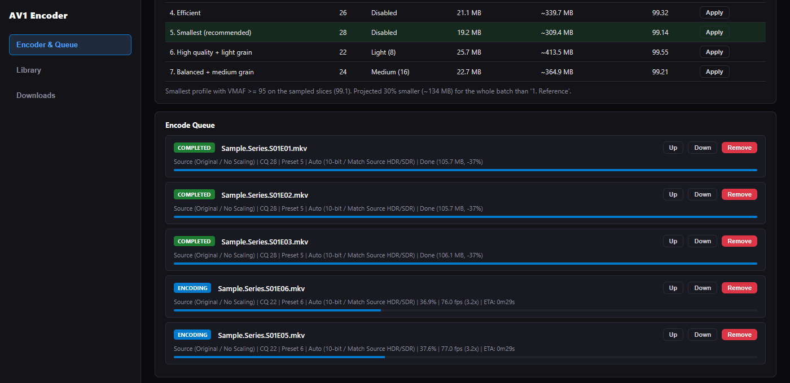
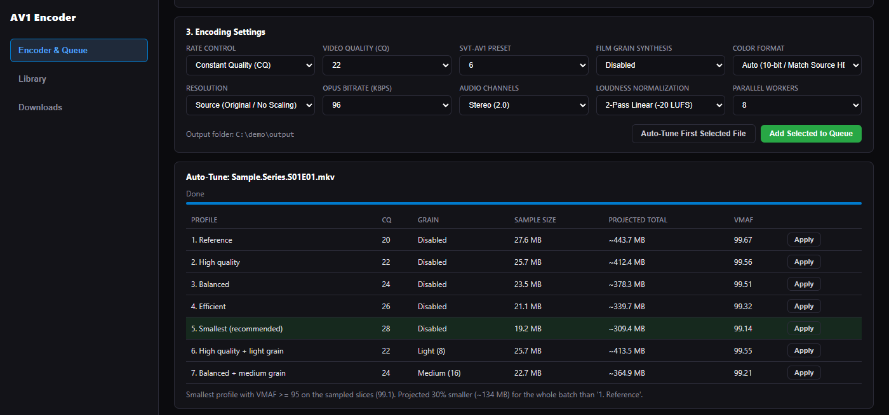
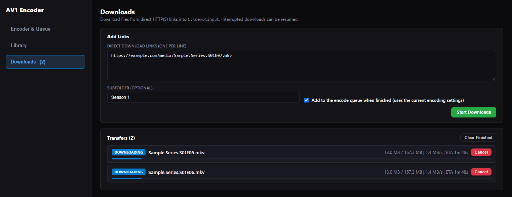

# AV1 Encoder

A self-hosted tool for batch-encoding a video library to AV1. It wraps FFmpeg
(SVT-AV1 for video, Opus for audio) and MKVToolNix behind a job queue, a web
dashboard and a command-line interface.

Video encoding uses SVT-AV1, which runs on the CPU. The only GPU use is
optional HDR-to-SDR tone-mapping through FFmpeg's `libplacebo` filter (Vulkan).

## Features

- **Concurrent job queue.** Several files are encoded in parallel by a worker
  pool. Jobs can be reordered, paused (the FFmpeg processes are suspended),
  resumed, retried and canceled.
- **Temporal chunking.** When a single long file is queued, it is split into
  time ranges that are encoded in parallel and then joined losslessly with
  `mkvmerge`, so one file can use more of the CPU.
- **VMAF-based auto-tune.** Takes four 7-second slices from across a file,
  encodes them with several CQ / film-grain profiles, scores each against the
  source with VMAF, and recommends the smallest profile that stays at or above
  VMAF 95.
- **Web dashboard with live WebSocket telemetry.** CPU, RAM, disk space, job
  progress (percentage, fps, speed, ETA), download progress and the encoder log
  are pushed to the browser.
- **URL downloader.** Paste direct HTTP(S) links to download files into the
  input folder. Downloads resume from where they stopped, and finished files can
  be added to the encode queue automatically.
- **Audio and subtitle handling.** Keep the track in a preferred language
  (configurable, default English), the preferred language plus the original
  track, the first track, or all tracks. Every kept track can be loudness
  normalized to EBU R128 (two-pass linear or one-pass dynamic) and encoded to
  Opus, as stereo or with 5.1 preserved. Subtitles, fonts and chapters are
  carried over from the source, and subtitles in the preferred language can be
  flagged automatically (signs/songs forced, or full subtitles on by default
  when the default audio is in another language).
- **Rate control.** Constant quality (CRF), or a target file size that is
  converted to a video bitrate after reserving space for audio and container
  overhead.
- **Cloud deployment script.** `deploy.sh` installs dependencies on a fresh
  Debian/Ubuntu machine, optionally joins a Tailscale network, and starts the
  dashboard.

## Screenshots

Encode queue with finished and running jobs:



Auto-tune results for a sample file:



Downloads in progress, set to add the files to the queue when they finish:



## Architecture

```text
web_app.py              FastAPI app: REST endpoints, WebSocket telemetry, serves the dashboard
cli.py                  Headless batch encoder for scripting
deploy.sh               Bootstrap script for a remote Linux machine
core/
  queue_manager.py      Background job queue: worker pool, temporal chunking, pause/resume/cancel
  encoder.py            Builds FFmpeg / mkvmerge commands; target-size bitrate calculation
  autotune.py           Multi-slice sample extraction, profile benchmark, VMAF scoring
  probe.py              ffprobe stream/HDR inspection and loudness measurement
  parser.py             Filename parser (SxxExx, 1x02, "Title - 05", specials, movies)
  job.py                Job dataclass and status values
  download_manager.py   Resumable HTTP(S) downloads
  process_utils.py      Suspend / resume / kill process trees (psutil)
  settings.py           Loads config.json and environment variable overrides
  constants.py          Option lists shared by the API, dashboard and CLI
templates/index.html    Dashboard markup
static/app.js           Dashboard logic (fetch + WebSocket)
static/style.css        Dashboard styles
tests/                  pytest suite (no FFmpeg or GPU required)
```

How a job runs:

1. `ffprobe` reads the duration, HDR metadata and audio/subtitle streams.
2. The video is encoded with SVT-AV1, either as one process or as parallel
   chunks that are joined with `mkvmerge`.
3. Audio tracks are selected by language, optionally loudness-measured, and
   encoded to Opus.
4. `mkvmerge` muxes video, audio, subtitles, attachments and chapters into the
   final `.mkv`. Work happens in a temporary folder until the output is complete.

The queue publishes events (`job_status`, `queue_updated`, `log`, ...) to
listeners. The web app forwards them to every connected WebSocket client and
also sends a telemetry message once a second.

## Setup

Requirements:

- Python 3.10+
- FFmpeg built with `libsvtav1`, `libopus` and `libvmaf` (VMAF is only needed
  for auto-tune), with `ffmpeg` and `ffprobe` on `PATH`
- MKVToolNix (`mkvmerge` on `PATH`)

```bash
python -m venv .venv
source .venv/bin/activate          # Windows: .venv\Scripts\activate
pip install -r requirements.txt
cp config.example.json config.json # then edit the paths
python web_app.py                  # http://127.0.0.1:8080
```

Command line:

```bash
python cli.py --input /path/to/input --output /path/to/output --workers 4 --cq 24 --audio-language eng
```

Remote machine:

```bash
./deploy.sh --port=8080 --tailscale-key=<auth key>
```

The dashboard has no authentication. By default it listens on `127.0.0.1`;
`deploy.sh` binds to `0.0.0.0`, so only run it on a private network such as a
Tailscale tailnet.

## Configuration

Settings are read from `config.json` in the project root (see
`config.example.json`). Environment variables take precedence.

| Setting          | Environment variable | Default             | Purpose                                 |
| ---------------- | -------------------- | ------------------- | --------------------------------------- |
| `input_dir`      | `AV1_INPUT_DIR`      | `downloads/raw`     | Source files and download destination   |
| `output_dir`     | `AV1_OUTPUT_DIR`     | `downloads/encoded` | Encoded output                          |
| `audio_language` | `AV1_AUDIO_LANGUAGE` | `eng`               | Preferred audio language (ISO 639 code) |
| (CLI flag)       | `AV1_HOST`           | `127.0.0.1`         | Web server bind address (`--host`)      |
| (CLI flag)       | `AV1_PORT`           | `8080`              | Web server port (`--port`)              |

Relative paths are resolved against the project root. The dashboard only reads,
moves and deletes files inside `input_dir` and `output_dir`.

## Development

```bash
pip install -r requirements-dev.txt
pytest
```

The tests cover the filename parser, target-size bitrate calculation, FFmpeg
command construction, audio track selection, queue operations, settings
loading, the resumable downloader (against a local HTTP server) and the API
endpoints. They do not need FFmpeg or a GPU. GitHub Actions runs them on every
push and pull request.

## License

MIT. See [LICENSE](LICENSE).
